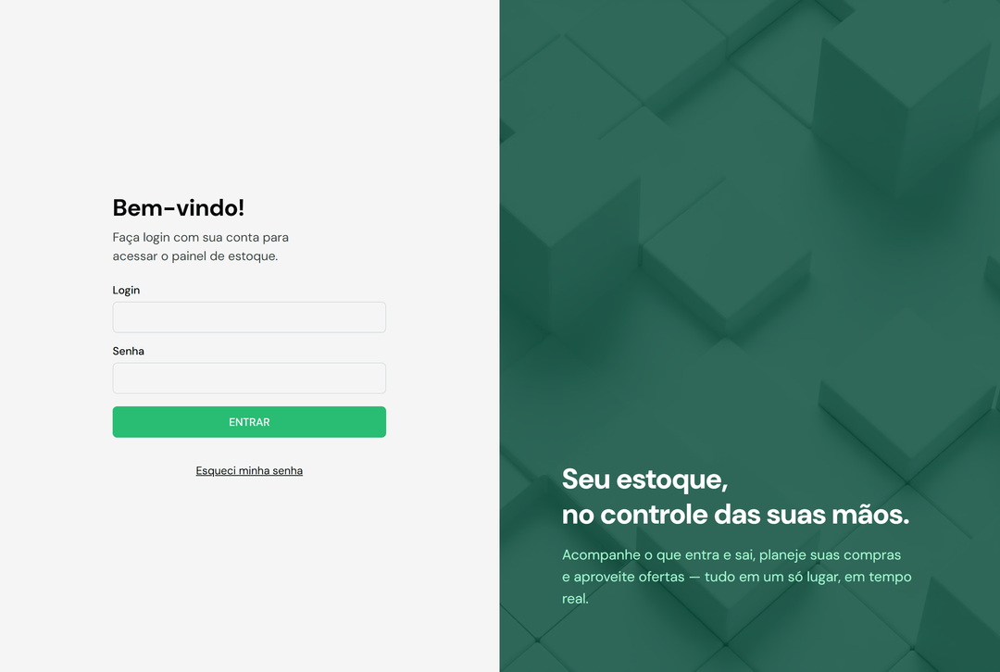
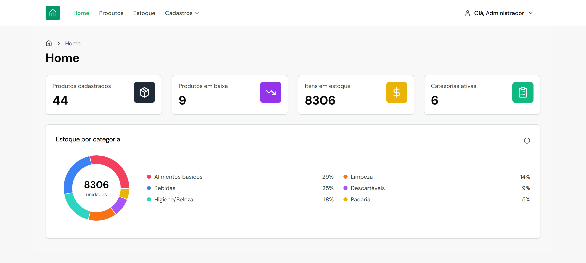
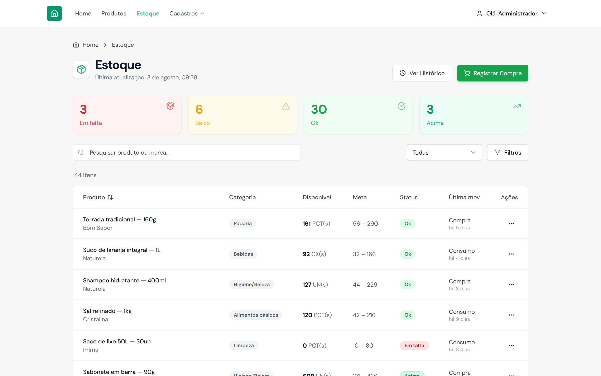
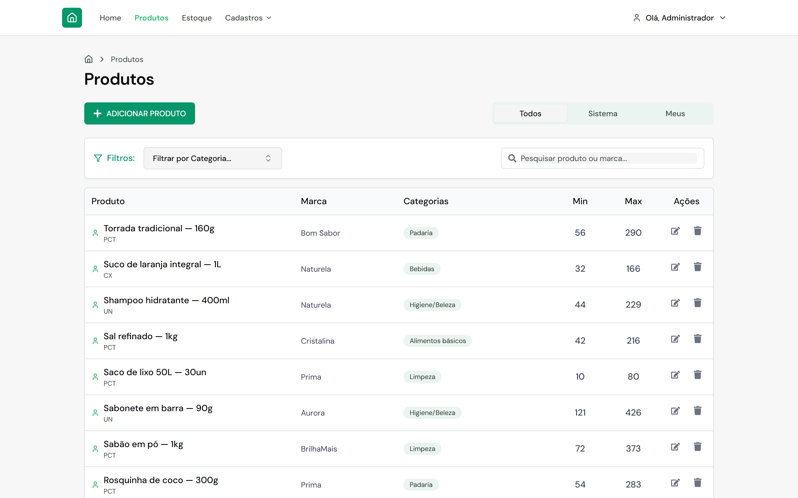
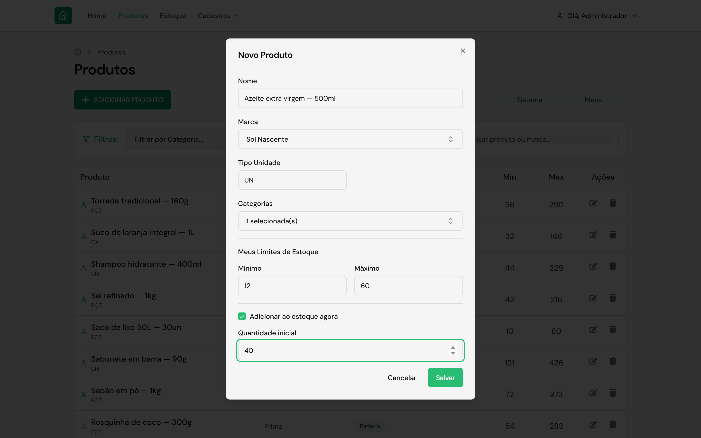
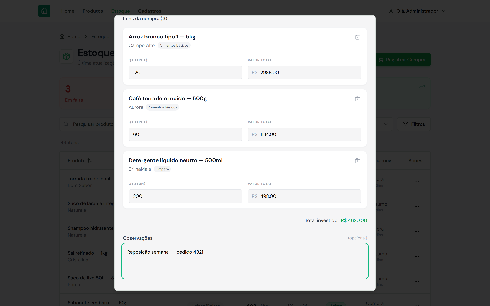
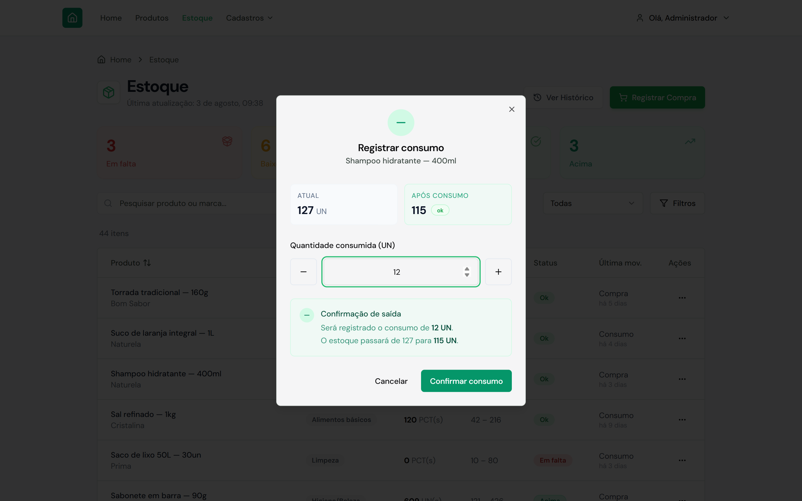
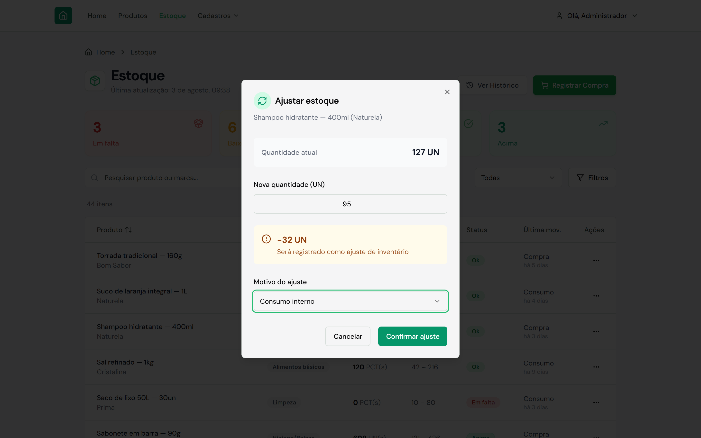
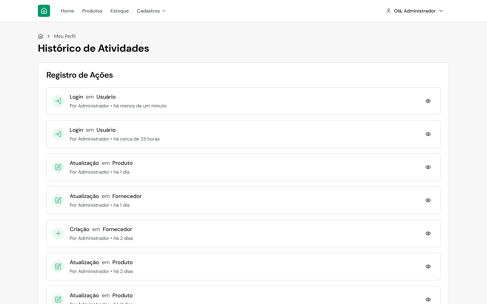

# Gerencie+ — Sistema de Gerenciamento de Estoque

Sistema web completo de gerenciamento de estoque com suporte multi-tenant, controle de movimentações, logs de auditoria e painel administrativo.

## Demonstração



<table>
  <tr>
    <td></td>
    <td></td>
  </tr>
  <tr>
    <td align="center"><sub>Dashboard — indicadores e estoque por categoria</sub></td>
    <td align="center"><sub>Estoque — status calculado por item</sub></td>
  </tr>
  <tr>
    <td></td>
    <td></td>
  </tr>
  <tr>
    <td align="center"><sub>Produtos — busca, filtros e paginação</sub></td>
    <td align="center"><sub>Cadastro — estoque inicial no próprio formulário</sub></td>
  </tr>
  <tr>
    <td></td>
    <td></td>
  </tr>
  <tr>
    <td align="center"><sub>Compra — múltiplos itens, fornecedor e total</sub></td>
    <td align="center"><sub>Consumo — saldo projetado antes de confirmar</sub></td>
  </tr>
  <tr>
    <td></td>
    <td></td>
  </tr>
  <tr>
    <td align="center"><sub>Ajuste — diferença calculada e motivo obrigatório</sub></td>
    <td align="center"><sub>Auditoria — quem fez o quê e quando</sub></td>
  </tr>
</table>

> As capturas usam dados fictícios gerados por `gerencie-api/scripts/demo-seed.ts`.
> Marcas e fornecedores exibidos não correspondem a empresas reais.

---

## Índice

- [Demonstração](#demonstração)
- [Visão Geral](#visão-geral)
- [Stack Tecnológica](#stack-tecnológica)
- [Arquitetura](#arquitetura)
- [Funcionalidades](#funcionalidades)
- [Estrutura de Pastas](#estrutura-de-pastas)
- [Início Rápido](#início-rápido)
- [Variáveis de Ambiente](#variáveis-de-ambiente)
- [Scripts Disponíveis](#scripts-disponíveis)
- [Credenciais Padrão](#credenciais-padrão)
- [Modelo de Dados](#modelo-de-dados)
- [API — Referência Completa](#api--referência-completa)
- [Controle de Acesso (RBAC)](#controle-de-acesso-rbac)
- [Logs de Auditoria](#logs-de-auditoria)

---

## Visão Geral

O **Gerencie+** é um sistema SaaS de gerenciamento de estoque construído com arquitetura de monorepo. Cada conta (empresa) opera de forma isolada, com acesso a um catálogo misto de produtos do sistema e produtos próprios. O sistema registra todas as movimentações de estoque (compras, consumo, ajustes) e mantém um histórico completo de auditoria de ações dos usuários.

---

## Stack Tecnológica

### Backend (`gerencie-api`)
| Tecnologia | Versão | Uso |
|---|---|---|
| Node.js | 20+ | Runtime |
| Express | 5.x | Framework HTTP |
| TypeScript | 5.x | Tipagem estática |
| Prisma | 6.x | ORM |
| SQLite | — | Banco de dados |
| JWT (jsonwebtoken) | 9.x | Autenticação |
| bcryptjs | 3.x | Hash de senhas |
| Zod | 3.x | Validação de schemas |
| tsx | 4.x | Execução TypeScript em desenvolvimento |

### Frontend (`gerencie-web-admin-front`)
| Tecnologia | Versão | Uso |
|---|---|---|
| Next.js | 15 | Framework React (App Router) |
| React | 18 | UI |
| TypeScript | 5.x | Tipagem estática |
| Tailwind CSS | 3.x | Estilização |
| shadcn/ui | — | Componentes de UI |
| Axios | — | Requisições HTTP |
| Recharts | — | Gráficos |
| date-fns | — | Formatação de datas |
| Lucide React | — | Ícones |

---

## Arquitetura

```
Gerencie+/
├── gerencie-api/              # Backend REST API (porta 3001)
└── gerencie-web-admin-front/  # Painel admin Next.js (porta 3000)
```

O frontend consome o backend via Axios com interceptors que injetam o JWT automaticamente. O backend usa Prisma como ORM com SQLite, adequado para instâncias únicas ou pequenos clusters.

### Fluxo de autenticação

```
Usuário → POST /auth/login → JWT (armazenado em cookie de sessão)
              ↓
Todas as requisições → Bearer Token no header Authorization
              ↓
authMiddleware → verifica JWT → injeta req.user (userId, accountId, role)
```

### Multi-tenancy

Cada registro sensível possui `ownerAccountId`. Registros com `ownerAccountId = 0` são do "sistema" e visíveis a todas as contas. Registros com `ownerAccountId = <id>` pertencem a uma conta específica. A lógica de filtro é aplicada em todas as queries.

---

## Funcionalidades

### Produtos
- Catálogo misto: produtos do sistema (compartilhados) e produtos próprios da conta
- Cadastro com nome, marca, unidade, categorias, limites mínimo/máximo de estoque
- **Adição de estoque inicial** diretamente no formulário de cadastro (checkbox + quantidade)
- Filtragem por busca, categoria, escopo (todos/sistema/meus) e ordenação
- Paginação

### Estoque
- Visualização do inventário com status calculado:
  - `em_falta` — estoque zerado
  - `baixo` — abaixo do mínimo
  - `ok` — dentro dos limites
  - `acima` — acima do máximo
  - `sem_meta` — sem limites definidos
- Compras: registro de entrada com fornecedor, itens múltiplos, valores e data
- Consumo: registro de saída com validação de saldo
- Ajuste manual: correção de saldo com motivo
- Histórico completo de movimentações com filtros por tipo, período, categoria e produto

### Categorias
- CRUD completo com busca e filtros
- Suporte a categorias do sistema e categorias próprias
- Prioridade de exibição configurável

### Fornecedores
- CRUD completo com nome e endereço
- Filtragem por escopo (sistema/próprios)
- Vinculação a compras

### Marcas
- CRUD completo com nome
- Marcas do sistema (somente leitura) e marcas próprias (edição/exclusão)
- Criação inline diretamente do seletor de marca no formulário de produto
- Proteção contra exclusão de marcas com produtos associados

### Dashboard
- Cards com dados reais: total de produtos, produtos em baixa, total de itens em estoque, categorias ativas
- Gráfico de pizza dinâmico: distribuição de estoque por categoria (dados reais da API)
- Atualização automática ao carregar a página

### Logs de Auditoria
- Registro automático de todas as ações: login, criação, edição e exclusão
- Entidades rastreadas: User, Product, Category, Brand, Supplier, Purchase, StockMovement
- Visualização no perfil do usuário com paginação
- Detalhes de cada log: valores anteriores e novos, usuário responsável, data/hora

### Navegação
- Header com dropdown **"Cadastros"** agrupando Categorias, Fornecedores e Marcas
- Links de navegação filtrados por papel do usuário (RBAC)
- Destaque de rota ativa

---

## Estrutura de Pastas

```
gerencie-api/
├── prisma/
│   ├── schema.prisma          # Modelos do banco de dados
│   └── seed.ts                # Dados iniciais
├── scripts/                   # Scripts utilitários
└── src/
    ├── index.ts               # Entry point (porta 3001)
    ├── app.ts                 # Configuração do Express + rotas
    ├── lib/
    │   ├── prisma.ts          # Cliente Prisma + helpers de paginação
    │   ├── jwt.ts             # Geração e verificação de tokens
    │   ├── scope.ts           # Helpers de escopo multi-tenant
    │   └── auditLog.ts        # Utilitário de log de auditoria
    ├── middleware/
    │   └── auth.ts            # Middleware de autenticação JWT
    └── routes/
        ├── auth.ts            # Autenticação e reset de senha
        ├── products.ts        # CRUD de produtos
        ├── categories.ts      # CRUD de categorias
        ├── brands.ts          # CRUD de marcas
        ├── suppliers.ts       # CRUD de fornecedores
        ├── inventory.ts       # Estoque, compras, consumo, ajustes
        ├── dashboard.ts       # Estatísticas e dados para dashboard
        └── audit-logs.ts      # Listagem de logs de auditoria

gerencie-web-admin-front/
└── src/
    ├── app/
    │   ├── login/             # Tela de login
    │   ├── dashboard/
    │   │   ├── page.tsx       # Home / Dashboard
    │   │   ├── layout.tsx     # Layout server-side (proteção de rota)
    │   │   ├── client-layout.tsx  # Layout client-side (header, nav)
    │   │   ├── produtos/      # Gerenciamento de produtos
    │   │   ├── estoque/       # Inventário e histórico
    │   │   ├── categorias/    # Gerenciamento de categorias
    │   │   ├── fornecedores/  # Gerenciamento de fornecedores
    │   │   ├── marcas/        # Gerenciamento de marcas
    │   │   └── perfil/        # Perfil + logs de auditoria
    │   └── update-password/   # Redefinição de senha
    ├── components/
    │   ├── products/          # Formulário, tabela, seletores de produto
    │   ├── categories/        # Componentes de categoria
    │   ├── suppliers/         # Componentes de fornecedor
    │   └── ui/                # Componentes shadcn/ui
    ├── services/              # Clients HTTP (Axios) por domínio
    ├── types/
    │   ├── req/               # Tipos de request
    │   └── res/               # Tipos de response
    └── lib/
        ├── rbac.ts            # Controle de acesso por papel
        ├── session.ts         # Gerenciamento de sessão
        ├── env.ts             # Variáveis de ambiente
        └── actions.ts         # Server actions (logout)
```

---

## Início Rápido

### Pré-requisitos

- Node.js 20+
- npm 9+

### 1. Clonar e instalar

```bash
git clone https://github.com/devguillen/Gerenciamento-de-estoque.git
cd Gerenciamento-de-estoque
```

### 2. Backend

```bash
cd gerencie-api
npm install
```

Crie o arquivo `.env` (veja [Variáveis de Ambiente](#variáveis-de-ambiente)), então:

```bash
npm run db:setup   # Cria o banco SQLite e popula com dados iniciais
npm run dev        # Inicia o servidor em modo watch (http://localhost:3001)
```

### 3. Frontend

Em outro terminal:

```bash
cd gerencie-web-admin-front
npm install
```

Crie o arquivo `.env.local` (veja [Variáveis de Ambiente](#variáveis-de-ambiente)), então:

```bash
npm run dev        # Inicia o app (http://localhost:3000)
```

Acesse **http://localhost:3000** e faça login com as [credenciais padrão](#credenciais-padrão).

---

## Variáveis de Ambiente

### Backend — `gerencie-api/.env`

```env
DATABASE_URL="file:./dev.db"
JWT_SECRET="sua-chave-secreta-longa-e-aleatoria"
PORT=3001
CORS_ORIGIN="http://localhost:3000"
```

| Variável | Obrigatória | Descrição |
|---|---|---|
| `DATABASE_URL` | Sim | Caminho do arquivo SQLite |
| `JWT_SECRET` | Sim | Segredo para assinar tokens JWT |
| `PORT` | Não | Porta da API (padrão: 3001) |
| `CORS_ORIGIN` | Não | Origem permitida pelo CORS (padrão: http://localhost:3000) |

### Frontend — `gerencie-web-admin-front/.env.local`

```env
AUTH_API_URL=http://localhost:3001
APP_API_URL=http://localhost:3001
SESSION_SECRET="sua-chave-de-sessao-longa-e-aleatoria"
```

| Variável | Obrigatória | Descrição |
|---|---|---|
| `AUTH_API_URL` | Sim | URL da API de autenticação |
| `APP_API_URL` | Sim | URL da API principal |
| `SESSION_SECRET` | Sim | Segredo para cifrar o cookie de sessão |

---

## Scripts Disponíveis

### Backend (`gerencie-api`)

```bash
npm run dev          # Inicia em modo desenvolvimento com hot-reload (tsx watch)
npm run build        # Compila TypeScript para JavaScript (dist/)
npm run start        # Inicia a build de produção

npm run db:push      # Aplica o schema ao banco sem migration (dev)
npm run db:migrate   # Cria e aplica migration
npm run db:generate  # Regenera o Prisma Client
npm run db:seed      # Executa o seed (dados iniciais)
npm run db:setup     # db:push + seed (setup completo do zero)
npm run db:reset     # Executa apenas o seed (re-popula sem recriar tabelas)

npm run test         # Executa os testes
```

**Scripts de demonstração** (usados para gerar as capturas do README, não fazem parte do fluxo normal):

```bash
npx tsx scripts/demo-seed.ts          # Substitui o catálogo por 44 produtos, 112 compras,
                                      # 854 movimentações e 110 logs fictícios em 90 dias
npx tsx scripts/demo-clean-logins.ts  # Remove os logins do dia gerados pela automação
```

`demo-seed.ts` **apaga** catálogo, movimentações e logs antes de recriar. Para voltar ao seed
oficial, rode `npm run db:setup`.

### Frontend (`gerencie-web-admin-front`)

```bash
npm run dev          # Inicia em modo desenvolvimento (http://localhost:3000)
npm run build        # Build de produção
npm run start        # Inicia o servidor de produção
npm run lint         # Executa o linter
```

---

## Credenciais Padrão

Criadas automaticamente pelo seed (`npm run db:setup`):

| Campo | Valor |
|---|---|
| E-mail | `admin@gerencie.com` |
| Senha | `Admin@123` |
| Papel | `admin` |
| Conta | `Conta Principal` |

---

## Modelo de Dados

### Entidades principais

```
Account          — Conta/empresa (multi-tenant)
User             — Usuário vinculado a uma Account
Product          — Produto do catálogo (sistema ou da conta)
Brand            — Marca do produto
Category         — Categoria do produto
Supplier         — Fornecedor
AccountProduct   — Configuração da conta para um produto (limites, favorito)
AccountCategory  — Associação categoria ↔ conta com prioridade
ProductCategory  — Associação produto ↔ categoria
Purchase         — Ordem de compra
PurchaseItem     — Item de uma compra
StockMovement    — Movimentação de estoque (PURCHASE | CONSUMPTION | ADJUSTMENT)
AuditLog         — Log de auditoria de todas as ações
PasswordResetToken — Token temporário para reset de senha
```

### Tipos de movimentação (`StockMovementType`)

| Tipo | Descrição |
|---|---|
| `PURCHASE` | Entrada via compra |
| `CONSUMPTION` | Saída por consumo |
| `ADJUSTMENT` | Ajuste manual de saldo |

### Status de inventário (calculado)

| Status | Condição |
|---|---|
| `em_falta` | `currentStock == 0` |
| `baixo` | `0 < currentStock <= minLimit` |
| `ok` | `minLimit < currentStock <= maxLimit` |
| `acima` | `currentStock > maxLimit` |
| `sem_meta` | Sem limites definidos |

---

## API — Referência Completa

Todas as rotas (exceto `/auth/login`, `/reset/*` e `/health`) exigem o header:
```
Authorization: Bearer <token>
```

### Autenticação

| Método | Rota | Descrição |
|---|---|---|
| `POST` | `/auth/login` | Login — retorna `authToken` |
| `GET` | `/auth/me` | Dados do usuário autenticado |
| `GET` | `/reset/request-reset-link?email=` | Solicita link de reset de senha |
| `POST` | `/reset/magic-link-login` | Login via magic link |
| `POST` | `/reset/update_password` | Atualiza a senha |
| `GET` | `/health` | Health check da API |

### Produtos

| Método | Rota | Descrição |
|---|---|---|
| `GET` | `/account/products` | Listar produtos (paginado, filtros, ordenação) |
| `POST` | `/product` | Criar produto |
| `PATCH` | `/product/:id` | Editar produto |
| `DELETE` | `/product/:id` | Excluir produto (soft delete) |

**Query params de `/account/products`:**
- `page`, `per_page` — paginação
- `search` — busca por nome
- `scope` — `all` | `system` | `mine`
- `sort_by` — campo de ordenação
- `sort_dir` — `asc` | `desc`
- `categories` — IDs de categorias separados por vírgula
- `brand` — nome ou ID da marca

### Marcas

| Método | Rota | Descrição |
|---|---|---|
| `GET` | `/brand` | Listar marcas (busca, paginação) |
| `POST` | `/brand` | Criar marca |
| `PATCH` | `/brand/:id` | Editar nome da marca |
| `DELETE` | `/brand/:id` | Excluir marca (falha se tiver produtos) |

### Categorias

| Método | Rota | Descrição |
|---|---|---|
| `GET` | `/account/categories` | Listar categorias (busca, escopo, paginação) |
| `POST` | `/category` | Criar categoria |
| `PATCH` | `/category/:id` | Editar categoria |
| `DELETE` | `/category/:id` | Excluir categoria |

### Fornecedores

| Método | Rota | Descrição |
|---|---|---|
| `GET` | `/account/suppliers` | Listar fornecedores (busca, escopo, paginação) |
| `POST` | `/supplier` | Criar fornecedor |
| `PATCH` | `/supplier/:id` | Editar fornecedor |
| `DELETE` | `/supplier/:id` | Excluir fornecedor |

### Estoque e Movimentações

| Método | Rota | Descrição |
|---|---|---|
| `GET` | `/account/inventory` | Inventário com status calculado e urgência |
| `GET` | `/inventory/summary` | Resumo: contagem por status |
| `GET` | `/account/stock_movements` | Histórico de movimentações (filtros, paginação) |
| `POST` | `/purchase` | Registrar compra (múltiplos itens) |
| `POST` | `/adjustment` | Ajuste manual de estoque |
| `POST` | `/consumption` | Registrar consumo |

**Query params de `/account/inventory`:**
- `page`, `per_page`
- `search`
- `status` — `em_falta` | `baixo` | `ok` | `acima` | `sem_meta`
- `categories`
- `sort_by`, `sort_dir`

**Query params de `/account/stock_movements`:**
- `page`, `per_page`
- `type` — `PURCHASE` | `CONSUMPTION` | `ADJUSTMENT`
- `date_from`, `date_to` — intervalo de datas
- `category`, `product`
- `search`, `sort_by`, `sort_dir`

### Dashboard

| Método | Rota | Descrição |
|---|---|---|
| `GET` | `/dashboard/stats` | Total de produtos e produtos em baixa |
| `GET` | `/dashboard/stock-by-category` | Distribuição de estoque por categoria (%) |

### Logs de Auditoria

| Método | Rota | Descrição |
|---|---|---|
| `GET` | `/audit-logs` | Listar logs da conta (paginado) |
| `GET` | `/audit-logs/:id` | Detalhes de um log específico |

**Query params de `/audit-logs`:** `page`, `limit`

---

## Controle de Acesso (RBAC)

### Papéis disponíveis

| Papel | Descrição |
|---|---|
| `admin` | Acesso total ao sistema |
| `stock_manager` | Acesso a produtos, estoque, fornecedores e marcas |
| `viewer` | Acesso somente de visualização (home e estoque) |

### Rotas por papel

| Rota | admin | stock_manager | viewer |
|---|:---:|:---:|:---:|
| `/dashboard` (Home) | ✅ | ✅ | ✅ |
| `/dashboard/produtos` | ✅ | ✅ | — |
| `/dashboard/estoque` | ✅ | ✅ | ✅ |
| `/dashboard/categorias` | ✅ | — | — |
| `/dashboard/fornecedores` | ✅ | ✅ | — |
| `/dashboard/marcas` | ✅ | ✅ | — |
| `/dashboard/perfil` | ✅ | ✅ | ✅ |

---

## Logs de Auditoria

Todas as ações abaixo são registradas automaticamente na tabela `AuditLog`:

| Ação | Entidade | Quando |
|---|---|---|
| `LOGIN` | `User` | Usuário faz login |
| `CREATE` | `Product` | Produto criado |
| `UPDATE` | `Product` | Produto editado |
| `DELETE` | `Product` | Produto excluído |
| `CREATE` | `Category` | Categoria criada |
| `UPDATE` | `Category` | Categoria editada |
| `DELETE` | `Category` | Categoria excluída |

Cada log armazena: `userId`, `accountId`, `action`, `entity`, `entityId`, `oldValues` (JSON), `newValues` (JSON), `ipAddress`, `userAgent`, `createdAt`.

Os logs são acessíveis na tela **Perfil** do painel administrativo, com paginação e visualização detalhada dos valores anteriores e atuais.

---

## Licença

Projeto privado — todos os direitos reservados.
